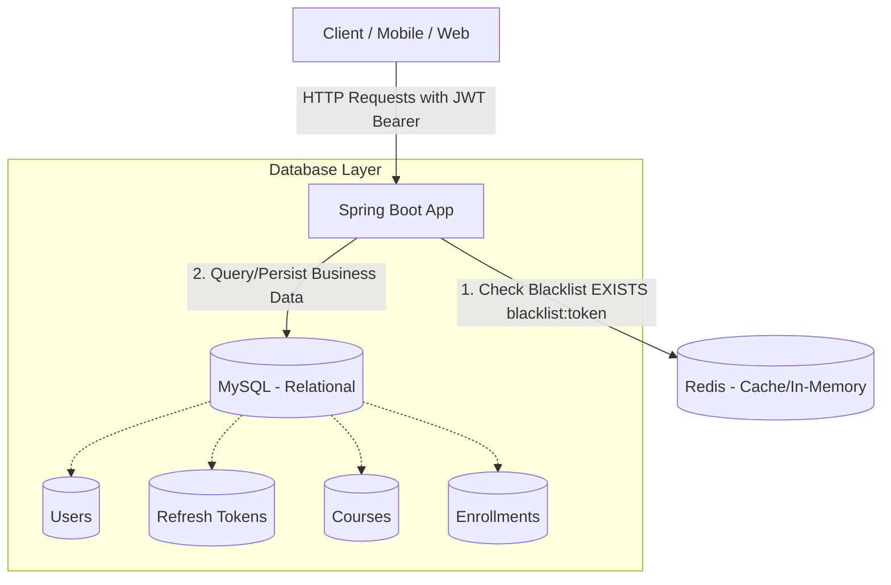

# Hướng dẫn Chạy ứng dụng & Tài liệu Kỹ thuật Redis Token Blacklist

Dự án đã được cấu hình và di chuyển cơ chế lưu trữ **Token Blacklist** (dành cho Access Token đã bị thu hồi sau khi logout) từ **MySQL** sang **Redis** để giải quyết triệt để vấn đề bottleneck hiệu năng.

---

## 1. Kiến trúc Hệ thống sau khi Chuyển sang Redis



---

## 2. Hướng dẫn Chạy ứng dụng

### Bước 1: Khởi động Redis bằng Docker Compose
Đảm bảo bạn đã cài đặt Docker và Docker Compose. Ở thư mục gốc của dự án, chạy lệnh:
```bash
docker compose up -d
```
Lệnh này sẽ khởi động container:
- **Redis**: Chạy trên cổng `6379`.

*(Lưu ý: MySQL đã được lược bỏ khỏi cấu hình Docker Compose để tiết kiệm RAM. Bạn hãy đảm bảo có dịch vụ MySQL chạy cục bộ trên máy hoặc môi trường khác phù hợp).*

### Bước 2: Chạy Ứng dụng Spring Boot
Dự án được cấu hình bằng **Gradle**. Bạn chạy lệnh sau để khởi động ứng dụng:
```bash
# Sử dụng Gradle (khuyến nghị cho dự án này)
./gradlew bootRun

# Hoặc sử dụng Maven (nếu bạn chuyển đổi build tool)
mvn spring-boot:run
```

---

## 3. Câu hỏi và Giải thích Kỹ thuật

### 3.1. Redis là gì?
**Redis** (Remote Dictionary Server) là một hệ thống lưu trữ dữ liệu dạng key-value trong bộ nhớ (In-memory database) mã nguồn mở. Nó hỗ trợ nhiều cấu trúc dữ liệu khác nhau như String, Hash, List, Set, Sorted Set,... và thường được sử dụng làm cơ sở dữ liệu phụ, bộ đệm (cache), hoặc hàng đợi tin nhắn (message broker) nhờ tốc độ cực kỳ nhanh.

### 3.2. Tại sao Redis phù hợp cho Token Blacklist?
1. **Tốc độ đọc/ghi cực nhanh**: Dữ liệu lưu hoàn toàn trên RAM giúp việc kiểm tra trạng thái token trong mỗi API request diễn ra tức thì.
2. **Cơ chế tự động hết hạn (TTL)**: Khi một Access Token hết hạn, nó không còn giá trị sử dụng nữa. Redis cho phép gán thời gian tồn tại (Time-to-Live) cho key, khi hết hạn Redis sẽ tự động xóa sạch key đó mà không cần viết batch job hay câu lệnh dọn dẹp thủ công.
3. **Giảm tải cho Database chính**: Tránh việc MySQL phải gánh hàng nghìn query đọc/ghi chỉ để kiểm tra trạng thái đăng xuất của token.

### 3.3. So sánh MySQL vs Redis
| Tiêu chí | MySQL | Redis |
| :--- | :--- | :--- |
| **Latency (Độ trễ)** | Cao hơn (vài mili-giây đến chục mili-giây do phải truy xuất đĩa cứng I/O). | Cực thấp (dưới 1 mili-giây do xử lý hoàn toàn trên RAM). |
| **Throughput (Băng thông)** | Giới hạn (hàng ngàn request/giây trên một instance thông thường). | Cực cao (hàng chục đến hàng trăm ngàn request/giây). |
| **Scalability (Khả năng mở rộng)** | Khó mở rộng theo chiều ngang (thường phải dùng Master-Slave replication, sharding phức tạp). | Rất dễ mở rộng theo chiều ngang (Redis Cluster, Sentinel). |

### 3.4. Giải thích TTL (Time-To-Live) trong Redis
- **TTL (Time-To-Live)** là khoảng thời gian sống của một key trong Redis.
- Khi lưu Access Token bị revoke vào Redis, ta thiết lập TTL bằng **thời gian còn lại của JWT** (Thời gian hết hạn của JWT trừ đi thời gian hiện tại).
- Khi TTL đếm ngược về 0, Redis sẽ tự động giải phóng key đó.

### 3.5. Tại sao không cần xóa token thủ công?
- Với tính năng TTL được tích hợp sẵn, Redis tự động giải phóng vùng nhớ và xóa key hết hạn dưới nền bằng các cơ chế:
  - **Passive (Lazy expiration)**: Khi người dùng truy cập vào key đã hết hạn, Redis phát hiện và xóa nó ngay lập tức.
  - **Active**: Định kỳ Redis quét ngẫu nhiên các key có gán TTL và xóa các key đã hết hạn.
- Nhờ vậy, nhà phát triển không cần cấu hình Cron Job hoặc Batch Job chạy SQL xóa dữ liệu rác.

### 3.6. Giải thích Bottleneck khi query blacklist từ Database (MySQL)
- Trong kiến trúc cũ, **JwtAuthenticationFilter** chạy trên **mọi request** của hệ thống.
- Ở mỗi request, bộ lọc phải thực hiện một truy vấn `SELECT EXISTS` vào bảng `token_blacklist` trong MySQL.
- **Bottleneck**:
  1. **Nghẽn kết nối (Connection Pool exhaustion)**: Số lượng kết nối đồng thời tới MySQL bị giới hạn (ví dụ: HikariCP mặc định là 10). Nếu hàng nghìn request đến cùng lúc, các luồng xử lý sẽ phải xếp hàng chờ kết nối DB.
  2. **I/O Disk**: Đọc dữ liệu từ đĩa cứng (ngay cả khi có index) vẫn chậm hơn RAM hàng nghìn lần.
  3. **Tốn tài nguyên CPU/RAM của DB**: MySQL dành quá nhiều tài nguyên cho việc kiểm tra token rác thay vì tập trung xử lý các transaction nghiệp vụ quan trọng (đặt hàng, truy vấn bài học, đăng ký khóa học).

---

## 4. Best Practices cho Spring Boot + JWT + Redis

1. **Serializer Nhất Quán**: Luôn cấu hình rõ ràng các bộ Serializer (ví dụ: `StringRedisSerializer`) cho `RedisTemplate` để tránh dữ liệu bị mã hóa thành ký tự lạ dạng Hex (`\xac\xed\x00\x05...`), giúp kiểm tra và debug dễ dàng bằng CLI.
2. **Xử lý bất đồng bộ hoặc Fault Tolerance**: Nếu Redis gặp sự cố (down), cần cấu hình cơ chế fallback hoặc bắt ngoại lệ khéo léo để tránh làm sập toàn bộ ứng dụng (tuy nhiên với hệ thống Security nghiêm ngặt, việc từ chối dịch vụ khi không xác thực được blacklist là một quyết định cần cân nhắc).
3. **Đặt prefix rõ ràng cho các Key**: Định nghĩa rõ prefix key (ví dụ: `blacklist:{token}`) để tránh đè cấu trúc dữ liệu hoặc xung đột key với các service khác chung Redis instance.
4. **Không đưa Refresh Token sang Redis bừa bãi**: Giữ Refresh Token ở MySQL để phục vụ việc audit log, thống kê phiên đăng nhập và revoke hàng loạt phiên bản của một người dùng khi cần.
